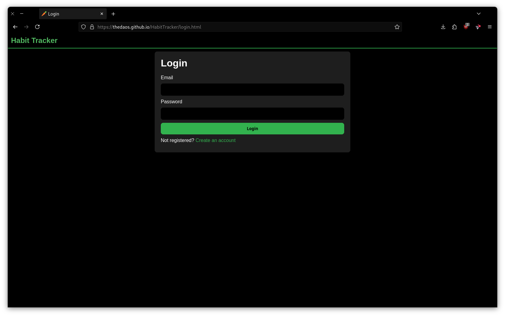
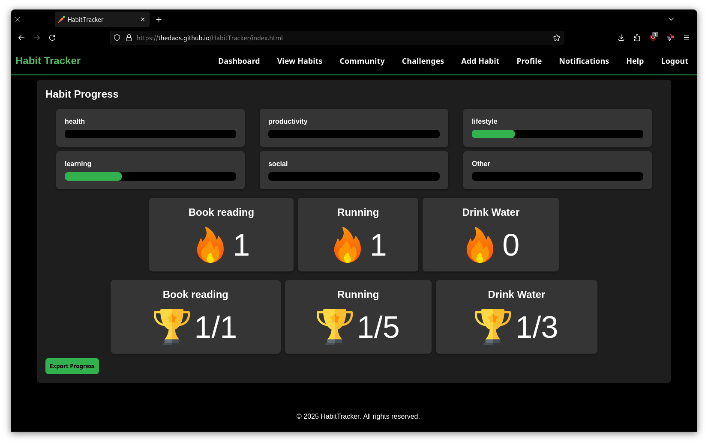
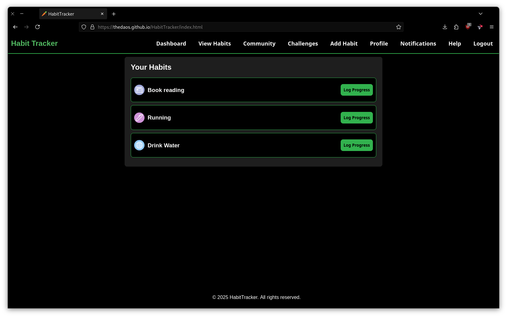
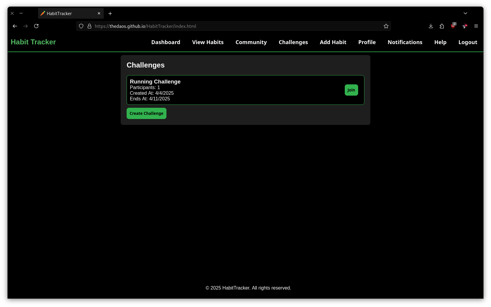

# HabitTracker

## Introduction
The Habit Tracker App is designed to help users build and maintain positive daily routines by tracking progress, visualization and personalized habit creation. 
This project aims to provide a comprehensive tool for users to track their habits, set goals, and achieve personal growth.

## Project Type
Frontend

## Deployed App
[GitHub Pages:](https://deployed-site.whatever)

## Directory Structure
HabitTracker/     
├─ favicon_io/    
│  ├─ android-chrome-192x192.png     
│  ├─ android-chrome-512x512.png   
│  ├─ apple-touch-icon.png   
│  ├─ favicon-16x16.png   
│  ├─ favicon-32x32.png   
│  ├─ favicon.ico   
│  ├─ site.webmanifest   
├─ images/   
│  ├─ carret.png   
│  ├─ streak.png   
│  ├─ trophy.png   
├─ screenshots/   
│  ├─ Challenges.png  
│  ├─ Dashboard.png  
│  ├─ Habits.png  
│  ├─ Login_page.png  
├─ LICENSE   
├─ README.md   
├─ firebase.js    
├─ index.html   
├─ login.html   
├─ register.html   
├─ style.css   

## Video Walkthrough of the project
Attach a very short video walkthough of all of the features [ 1 - 3 minutes ]

## Video Walkthrough of the codebase
Attach a very short video walkthough of codebase [ 1 - 5 minutes ]

## Features

- DashBoard
- Custom habit creation
- Custom Chalanges creation

## design decisions or assumptions
List your design desissions & assumptions

## Installation & Getting started

```bash
git clone https://github.com/TheDAOS/HabitTracker.git
cd HabitTracker/
```
Use any preferred live server and open index.html in the live server

## Usage
Provide instructions and examples on how to use your project.

```bash
# Example
```

- Login Page
    

- Dashboard
    

- Habits
    

- Challenges
    

## Credentials
name, email and password

## APIs Used
[DiceBear](https://www.dicebear.com/) for habit icons

## Technology Stack
List and provide a brief overview of the technologies used in the project.

- HTML, CSS
- JavaScript
- Firebase
- FireStore
